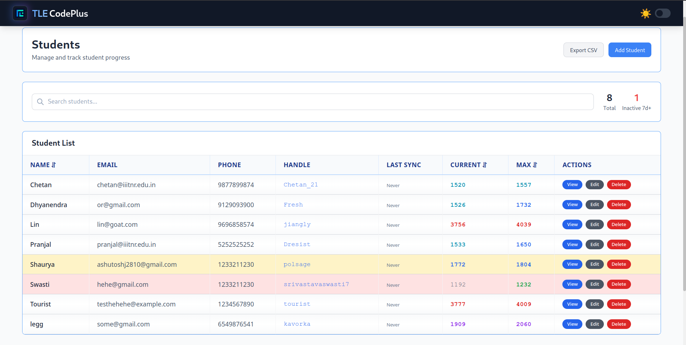
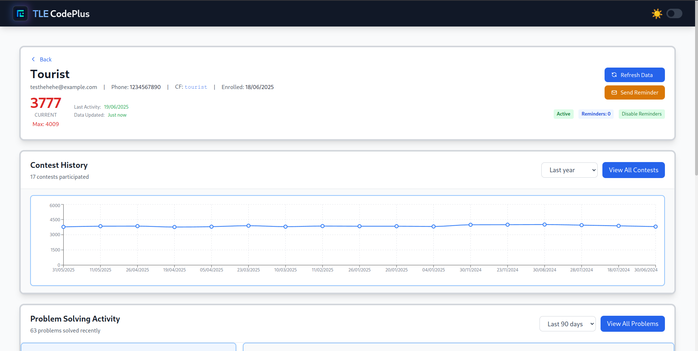
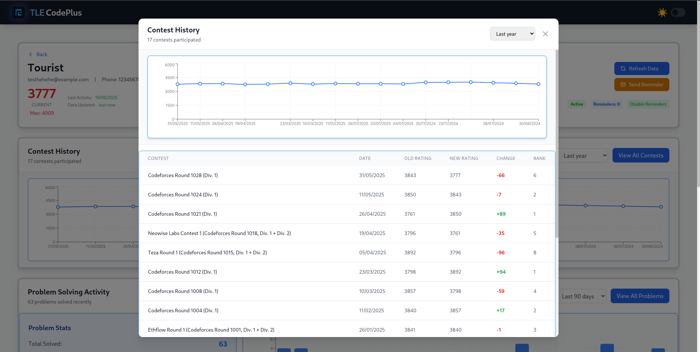
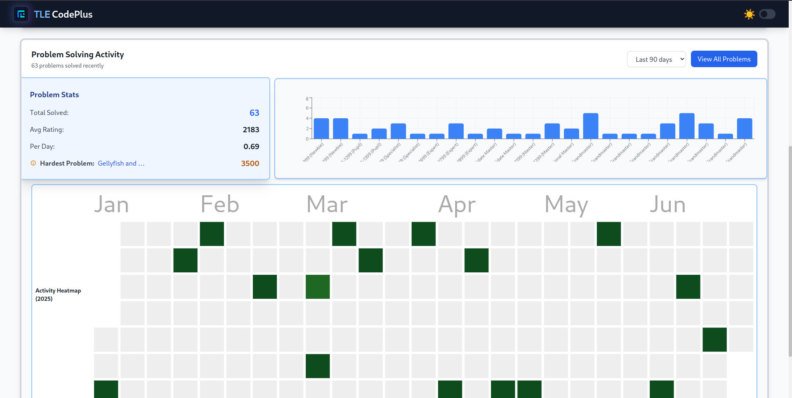
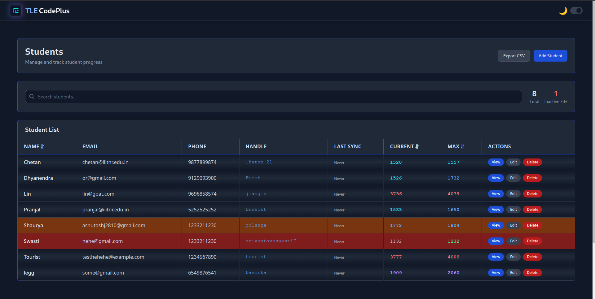
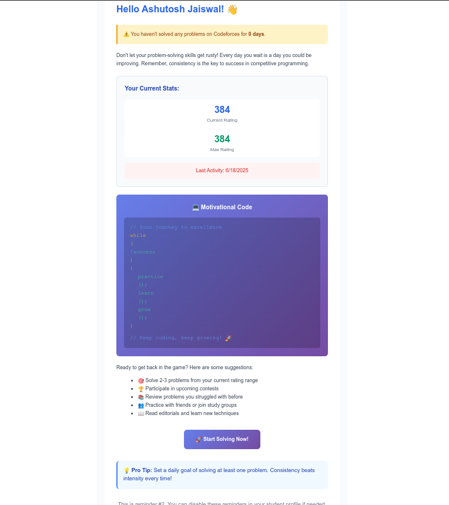

# TLE CodePlus


- **Walkthrough Video:** [https://drive.google.com/file/d/1qmWsmpT6ouuzN-rjlaXYkKhqNGnsrh9i/view?usp=sharing](https://drive.google.com/file/d/1qmWsmpT6ouuzN-rjlaXYkKhqNGnsrh9i/view?usp=sharing)

- **Report:** [https://drive.google.com/file/d/1tQuz3Xa6k24m3PxPxcliofz0Oez6MVpu/view?usp=sharing](https://drive.google.com/file/d/1tQuz3Xa6k24m3PxPxcliofz0Oez6MVpu/view?usp=sharing)


## 🚀 Live Demo

- **Frontend:** [https://tle-code-plus.vercel.app/](https://tle-code-plus.vercel.app/)
- **Backend API:** [https://tle-codeplus.onrender.com/](https://tle-codeplus.onrender.com/)


A MERN stack application for tracking student progress in competitive programming with Codeforces integration.


## Screenshots

### Student Table

*Main dashboard with student list, search, and management features*

### Student Profile

*Individual student view with contest history and rating charts*

### Contest History

*Rating progression and contest performance tracking*

### Problem Stats

*Problem-solving statistics and difficulty analysis*


### Dark Mode

*Complete dark theme across all components*

### Email Reminder



## API Endpoints

### Students
- `GET /api/students` - Get all students
- `POST /api/students` - Create new student
- `GET /api/students/:id` - Get student by ID
- `PUT /api/students/:id` - Update student
- `DELETE /api/students/:id` - Delete student
- `POST /api/students/:id/sync` - Sync with Codeforces

### Contests
- `GET /api/contests/:studentId` - Get student's contests
- `POST /api/contests` - Add contest data
- `PUT /api/contests/:id` - Update contest
- `DELETE /api/contests/:id` - Delete contest

### Problems
- `GET /api/problems/:studentId` - Get student's problems
- `POST /api/problems` - Add problem data
- `GET /api/problems/stats/:studentId` - Get problem statistics

### Codeforces Integration
- `POST /api/codeforces/sync/:handle` - Manual sync student data
- `GET /api/codeforces/user/:handle` - Get user info
- `GET /api/codeforces/submissions/:handle` - Get submissions

## Database Schema

### Student Model
```javascript
{
  name: String,
  email: String,
  phoneNumber: String,
  codeforcesHandle: String,
  currentRating: Number,
  maxRating: Number,
  enrollmentDate: Date,
  isActive: Boolean,
  lastUpdated: Date,
  lastSubmissionDate: Date,
  lastDataSync: Date
}
```

### Contest Model
```javascript
{
  studentId: ObjectId,
  contestId: Number,
  contestName: String,
  contestDate: Date,
  oldRating: Number,
  newRating: Number,
  rank: Number,
  problemsSolved: Number,
  totalProblems: Number,
  ratingChange: Number,
  contestType: String
}
```

### Problem Model
```javascript
{
  studentId: ObjectId,
  problemId: String,
  problemName: String,
  contestId: Number,
  problemIndex: String,
  rating: Number,
  tags: [String],
  solvedDate: Date,
  submissionId: Number,
  verdict: String,
  programmingLanguage: String,
  timeConsumed: Number,
  memoryConsumed: Number,
  points: Number
}
```
